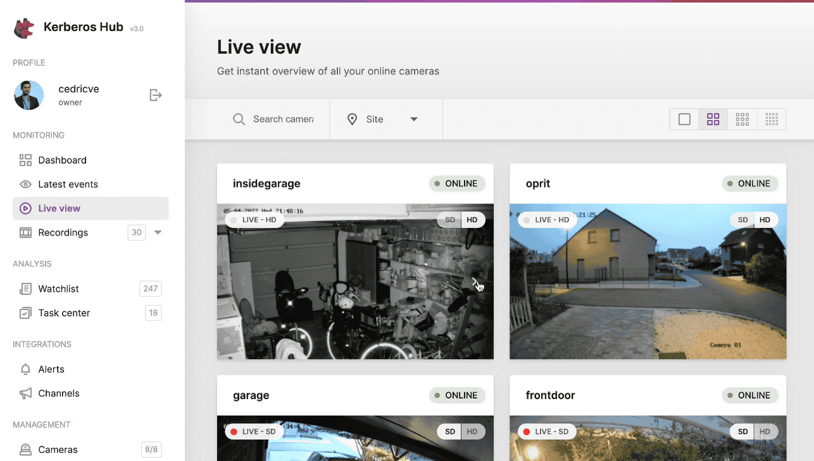

When adding and deploying your Kerberos Agents you have [the option to enable ONVIF](/factory/getting-started/#adding-a-new-deployment) integration. Once enabled and connected properly to your camera using ONVIF, you can leverage specific functions and features of the camera, such as as PTZ, Streaming Profiles, etc. Which features are available depends on the camera you are using, and [which ONVIF profiles](https://www.onvif.org/profiles) are supported.

When connecting your Kerberos Agents to Kerberos Hub, you can start leveraging those capabilities. This means that certain ONVIF actions are forwarded from Kerberos Hub to the (edge deployed) Kerberos Agents. The forwarding is happening through the MQTT bidirectional connection you have setup. In other words this setup allows you to control your cameras from the internet without needing any port forwarding or special network sessions.

## PTZ

One of the key elements of ONVIF is the ability to control PTZ or use and configure presets, without using the builtin controls and application of the camera provider. By leveraging the ONVIF protocol providers such as Kerberos.io can leverage capabilities such as PTZ in its own application and user interface. 

This brings several of advantages, such as an unified experience independent of the camera brand, which usually end up in more scalable and well designed user interfaces. At least that's what our mission is at Kerberos.io.

When browsing to the livestream page of a specific camera or groups of camera, you will see some of the PTZ functions visualised. Using the pan title, you can move the camera from left to right, top to bottom or the other way around. By pressing the center button, you will move the camera to its center location.

A couple of more features will be added shortly and are scheduled on our roadmap: such as Zoom out and Zoom in control, and the ability to set/get presets PTZ positions.